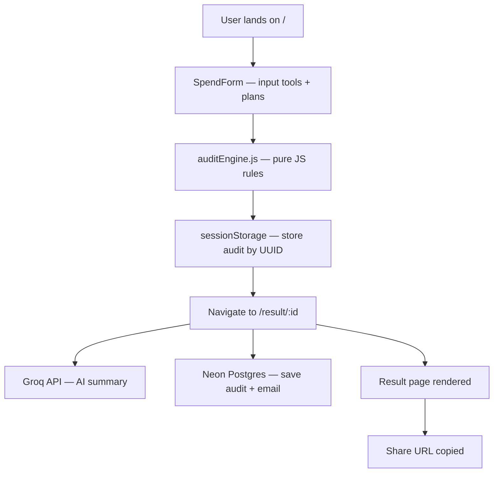

# Architecture

## System Diagram

## Data Flow

1. User fills SpendForm with tools, plans, seats, spend
2. On submit, `runAudit()` runs synchronously in the browser — no API call
3. Result stored in sessionStorage with a UUID key
4. User navigated to `/result/:id`
5. Result page reads from sessionStorage, fires two async calls: Groq for summary, Neon for persistence
6. Share URL is just the current window URL — anyone with the UUID can see the public result (identifying info stripped)

## Stack Choices

- **React + Vite** — fast dev, simple SPA, no SSR needed
- **TypeScript** — catches bugs at compile time, preferred by assignment
- **Tailwind CSS v3** — utility-first, no design system overhead
- **Groq (llama-3.3-70b)** — fast, free tier, good quality for short summaries
- **Neon Postgres** — serverless Postgres, free tier, no connection pool needed
- **Vercel** — zero config deploy, environment variable support

## Scaling to 10k audits/day

- Move audit save from client-side fetch to a Vercel Edge Function — keeps DB credentials server-side
- Add Redis cache for repeated identical audits
- Rate limit by IP at the edge
- Neon scales automatically; no changes needed there

## Known Limitations

- Transactional email (Resend) not implemented — requires a server-side API route to avoid exposing the API key in the browser bundle. Would be a 2-hour addition with a Vercel serverless function.
- Audit share URLs load from sessionStorage — works for same-browser sharing. Full cross-device sharing requires loading audit data from Neon by ID on the Result page.
